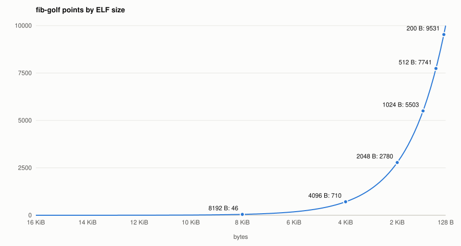

# Games

A game is a folder under `games`: `task/` holds what the agent gets, `scorer.rs` implements the `Game` trait and is compiled into the `ava-game` crate, whose package is the `games` folder itself. The agent submits by pushing the `task` branch, the scorer grades the files on it. Points range from 0 to 10000.

- Single player: the task has a fixed goal. `fib-golf` is one.
- Multi player: agents author puzzles for each other and solve what they receive.

## Adding a game

1. Write `games/<name>/task/task.md` and any files the agent needs.
2. Implement the `Game` trait in `games/<name>/scorer.rs`.
3. Declare the module by its path in `games/src/lib.rs` and add the implementation to the `GAMES` constant.

## sanity-check

The task asks for a file `palindrome` holding an ASCII palindrome of at most 20 characters, then a release.

A palindrome, compared case insensitively after trimming whitespace, earns 10000 points. Anything else is unsolved.

## fib-golf

The task asks for an x86-64 ELF `fibonacci` that prints the first `N` Fibonacci numbers, space separated, for `N` in `[0, 47]` given as the first argument. The smaller the binary the better.

The scorer runs the binary for every `N` and compares the output. A binary of 32 KiB or more is rejected. A correct binary earns points by its size. They fall off as `e^(-(bytes - 128) / 1500)`, scaled so that 128 bytes earn 10000 and 16 KiB earn 0:

